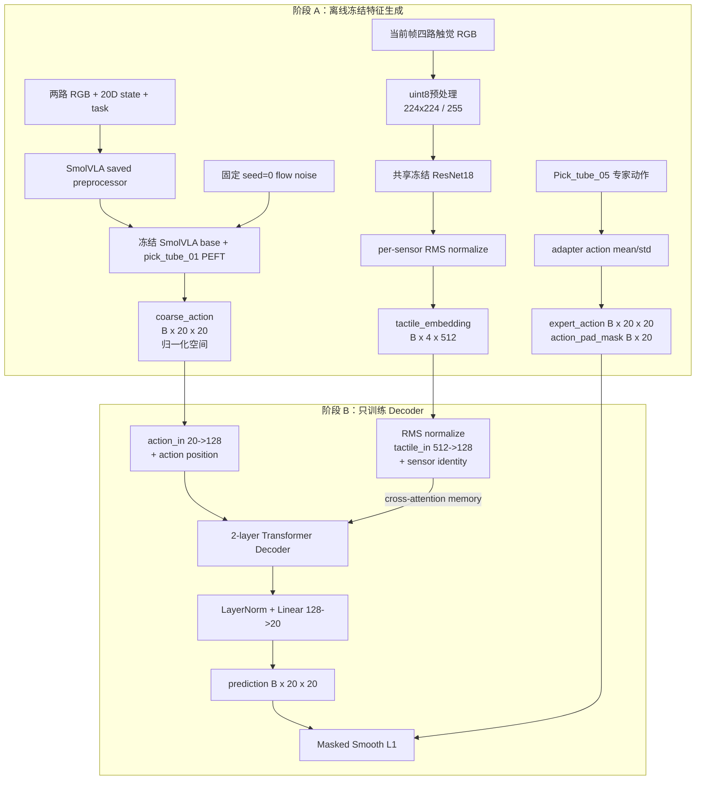

# Direct Tactile Action Decoder：完整网络结构与实验协议

本文档描述 VB3 当前 `DirectTactileActionDecoder` 实验的**实际代码结构**，用于模型复现、论文讨论和跨团队交接。

## 1. 一句话概述

该系统先用冻结的 SmolVLA 离线生成一个归一化粗动作块，用冻结的触觉 ResNet18 离线生成四个当前帧触觉 token，再训练一个 471,828 参数的两层 Transformer Decoder，直接重新生成完整动作块：

\[
f_\theta:
\left(
A_{\text{SmolVLA}}\in\mathbb{R}^{20\times20},
T\in\mathbb{R}^{4\times512}
\right)
\rightarrow
\hat A\in\mathbb{R}^{20\times20}.
\]

输出是完整新动作，不是 `coarse_action + residual`。

## 2. 关键实验边界

| 模块 | 资产 | 状态 | Decoder 训练时是否运行 |
|---|---|---:|---:|
| SmolVLA base | `lerobot/smolvla_base`，revision `c83c3163...` | 冻结 | 否 |
| SmolVLA PEFT adapter | `KaiyueChen/pick_tube_01`，revision `c2bb4296...` | 冻结 | 否 |
| 触觉 encoder | `KaiyueChen/encoder_ckpt_0809` 转换后的 ResNet18 | 冻结、永久 eval | 否 |
| DirectTactileActionDecoder | 本文第 8 节 | 可训练 | 是 |

该实验不是端到端联合训练，而是两个阶段：

1. 离线运行冻结 producer，生成不可变数值 cache。
2. 只读取 cache，训练小型动作 decoder。

训练程序接收冻结资产路径是为了验证 SHA256 provenance；它不会在训练 loop 中再次加载或运行 SmolVLA/触觉 encoder。

## 3. 整体数据流



## 4. 离线 cache 的每行内容

| 字段 | dtype | shape | 含义 |
|---|---|---:|---|
| `episode_index` | int64 | `[]` | 原始 episode ID |
| `frame_index` | int64 | `[]` | episode 内 anchor 帧 |
| `split_id` | int64 | `[]` | train=0，val=1，test=2 |
| `coarse_action` | float32 | `[20,20]` | 冻结 SmolVLA 的归一化动作块 |
| `tactile_embedding` | float32 | `[4,512]` | 四路当前帧触觉特征 |
| `expert_action` | float32 | `[20,20]` | 归一化专家动作块 |
| `action_pad_mask` | bool | `[20]` | 哪些未来时间步有效 |

Cache 不包含原始 RGB、原始触觉图像、state、task token、SmolVLA hidden state 或 ResNet feature map。

## 5. 冻结 SmolVLA 粗动作 producer

### 5.1 有效输入

每个 anchor 使用一个当前观测步：

| 输入 | shape |
|---|---:|
| 两路 RGB | 每路 `[3,224,224]`，processor 后进入有效 camera1/camera2 |
| `observation.state` | `[20]` |
| task | 字符串，token 长度固定为 48 |

原始 `camera0/camera1` 由 adapter processor 映射为 SmolVLA 的有效 `camera1/camera2`。触觉图像绝不进入 SmolVLA preprocessor。

运行时强制使用实际 20D state、20D action、两路相机和 `empty_cameras=0`；不能直接把 adapter `config.json` 中陈旧的 6D/额外相机 metadata 当成有效输入契约。

### 5.2 模型与 PEFT

- VLM：`HuggingFaceTB/SmolVLM2-500M-Video-Instruct`
- VLM layers：16
- Action expert layers：16（来自 `pick_tube_01` adapter 有效配置）
- PEFT：LoRA，`r=16`，`alpha=16`，dropout=0
- LoRA target：VLM text layers self-attention 的 `q_proj` 和 `v_proj`
- 额外保存/训练过的 adapter 模块：language expert、state/action projection 和 action-time MLP
- 当前 decoder 实验中以上所有模块均冻结

加载后执行：

```python
PeftModel.from_pretrained(..., is_trainable=False)
for parameter in policy.parameters():
    parameter.requires_grad_(False)
policy.eval()
```

SmolVLA 前向还在 `torch.inference_mode()` 下运行。

### 5.3 粗动作生成

每个 anchor 使用固定噪声：

```text
seed             = 0
external noise   = [B,20,20]
internal padding = [B,20,32]
flow steps       = 10
```

内部动作最大维度为 32，最终只保留前 20 个有效动作维度：

```text
frozen SmolVLA output [B,20,32]
              unpad ↓
coarse_action        [B,20,20]
```

`coarse_action` 没有经过 postprocessor，仍处于 adapter 保存的 mean/std 归一化空间。

## 6. 冻结触觉 encoder

当前 direct-decoder 实验使用的是 `encoder_ckpt_0809` 中的 Flax ResNet18 转换结果，不是 AnyTouch2，也不是两帧触觉 VideoMAE。

### 6.1 四路输入顺序

```text
0. observation.images.tactile_left_0
1. observation.images.tactile_right_0
2. observation.images.tactile_left_1
3. observation.images.tactile_right_1
```

四路都是当前帧；该实现不使用首帧背景差分和触觉历史。

### 6.2 图像预处理

输入必须是 uint8 RGB，支持 NHWC 或 NCHW：

1. 转为 NCHW float32。
2. 保持宽高比缩放到不超过 `224x224`。
3. 缩小时使用 area，放大时使用 bilinear。
4. 中心补零到 `224x224`。
5. 除以 255，得到 `[0,1]`。
6. 不使用 ImageNet mean/std。

原始 Pick_tube_05 触觉图像已经是 `224x224`，因此实际主要执行通道转换和 `/255`。

### 6.3 ResNet18 逐层结构

所有卷积使用与 Flax/TensorFlow 一致的动态 SAME padding。

| 阶段 | 结构 | 输出 shape |
|---|---|---:|
| 输入 | RGB float32 | `[N,3,224,224]` |
| Stem | Conv `7x7`, 3→64, stride 2；BN；ReLU | `[N,64,112,112]` |
| Pool | MaxPool `3x3`, stride 2 | `[N,64,56,56]` |
| Layer 1 | 2×BasicBlock，64→64 | `[N,64,56,56]` |
| Layer 2 | 2×BasicBlock，首块 stride 2，64→128 | `[N,128,28,28]` |
| Layer 3 | 2×BasicBlock，首块 stride 2，128→256 | `[N,256,14,14]` |
| Layer 4 | 2×BasicBlock，首块 stride 2，256→512 | `[N,512,7,7]` |
| 输出 | 空间维度 global average | `[N,512]` |

BasicBlock：

```text
input ───────────────────────────────┐
  │                                  │ identity / 1x1 Conv+BN
  └→ Conv3x3 → BN → ReLU → Conv3x3 → BN
                                      +
                                      ↓
                                    ReLU
```

Layer 2–4 的首个 block 使用 stride-2 的 `1x1 Conv + BN` residual projection。模型没有分类 FC 层。

### 6.4 四路 batch 编码

```text
[B,4,3,224,224]
       flatten sensor dimension
[B*4,3,224,224]
       shared frozen ResNet18
[B*4,512]
       RMS normalize
[B*4,512]
       reshape
[B,4,512]
```

RMS normalization：

\[
z=\frac{f}{\sqrt{\operatorname{mean}(f^2)+10^{-6}}}.
\]

四路在 encoder 内互不交互；它们只在后续 Transformer cross-attention 中融合。

### 6.5 冻结与参数量

| 模块 | 参数量 |
|---|---:|
| conv1 | 9,408 |
| bn1 | 128 |
| layer1 | 147,968 |
| layer2 | 525,568 |
| layer3 | 2,099,712 |
| layer4 | 8,393,728 |
| **总参数** | **11,176,512** |
| **可训练参数** | **0** |

Encoder 构造时就执行 `eval()` 和 `requires_grad_(False)`，并重写 `train()`，所以外部调用 `train(True)` 也不会更新 BatchNorm 统计量。

## 7. Decoder 输入 token 构造

固定配置：

| 字段 | 数值 |
|---|---:|
| chunk/action horizon | 20 |
| action dimension | 20 |
| tactile token count | 4 |
| tactile embedding dimension | 512 |
| `d_model` | 128 |
| attention heads | 4 |
| head dimension | 32 |
| decoder layers | 2 |
| FFN hidden dimension | 256 |
| dropout | 0.1 |

### 7.1 动作 query token

输入：

```text
coarse_action [B,20,20]
```

共享线性投影并加入可学习时间位置：

\[
q_t=W_a a_t+b_a+p_t,
\]

```text
Linear(20→128)          [B,20,128]
action_position         [20,128]
动作 query token         [B,20,128]
```

`action_position` 用 `Normal(std=0.02)` 初始化。

### 7.2 触觉 memory token

输入：

```text
tactile_embedding [B,4,512]
```

Decoder 会对 cache embedding 再做一次防御性 per-token RMS normalization，然后使用一个共享 Linear：

\[
m_i=W_t\operatorname{RMSNorm}(t_i)+b_t+s_i,
\]

```text
RMS normalize            [B,4,512]
Linear(512→128)          [B,4,128]
sensor_identity          [4,128]
触觉 memory token         [B,4,128]
```

这里没有额外两层 MLP、激活函数或 tactile positional encoding。`sensor_identity` 表示四个物理传感器身份，用 `Normal(std=0.02)` 初始化。

触觉 token 不与动作 token 直接拼接，而是作为 Transformer Decoder 的 `memory`。

## 8. 两层 Transformer Decoder

PyTorch 配置：

```python
nn.TransformerDecoderLayer(
    d_model=128,
    nhead=4,
    dim_feedforward=256,
    dropout=0.1,
    activation="relu",
    batch_first=True,
    norm_first=True,
)
```

未传入 causal mask、target padding mask 或 memory mask。因此：

- 20 个动作 token 之间是非因果全连接 self-attention。
- 每个动作 token 都能 cross-attend 全部四个触觉 token。

每层：

```text
动作 token [B,20,128]
   ↓ Pre-Norm self-attention：20个动作时间步相互建模
   ↓ residual
   ↓ Pre-Norm cross-attention：Q来自动作，K/V来自4个触觉memory
   ↓ residual
   ↓ Pre-Norm FFN：Linear 128→256 → ReLU → Dropout → Linear 256→128
   ↓ residual
输出 [B,20,128]
```

两层后：

```text
[B,20,128]
    ↓ LayerNorm(128)
    ↓ Linear(128→20)
[B,20,20]
```

输出层没有激活函数。输出本身就是最终归一化动作块。

## 9. Decoder 精确参数量

| 模块 | 参数 shape / 映射 | 参数量 |
|---|---|---:|
| `action_in` | Linear 20→128 | 2,688 |
| `action_position` | `[20,128]` | 2,560 |
| `tactile_in` | Linear 512→128 | 65,664 |
| `sensor_identity` | `[4,128]` | 512 |
| Transformer layer 0 | self-attn + cross-attn + FFN + 3 norms | 198,784 |
| Transformer layer 1 | self-attn + cross-attn + FFN + 3 norms | 198,784 |
| `action_out` | LayerNorm + Linear 128→20 | 2,836 |
| **总计** |  | **471,828** |

每个 Transformer layer：

| 子模块 | 参数量 |
|---|---:|
| action self-attention | 66,048 |
| tactile cross-attention | 66,048 |
| FFN | 65,920 |
| 3×LayerNorm | 768 |
| **每层总计** | **198,784** |

两层 Transformer 合计 397,568 参数。

## 10. Action+tactile 与 Action-only

两个模式使用相同类、相同名义参数量，但分别训练独立 checkpoint。

| 项目 | Action+tactile | Action-only |
|---|---|---|
| coarse action | 使用 | 使用 |
| 真实 tactile embedding | 使用 | 忽略 |
| memory 输入 | 当前样本 `[B,4,512]` | 内部全零 `[B,4,512]` |
| projection 后 memory | `Linear(RMS(tactile))+sensor_id` | `Linear(0)+sensor_id` |
| memory 含义 | 样本相关触觉 token | 四个可学习常量 token |
| 参数量 | 471,828 | 471,828 |

Action-only 中：

\[
m_i=b_t+s_i.
\]

`tactile_in.weight` 的输入恒为零，因此对 forward 没有数据相关贡献；`tactile_in.bias` 和 `sensor_identity` 仍会通过 cross-attention 学习。所有名义参数都被放入 AdamW，但不应声称 action-only 中每个参数都收到非零数据梯度。

## 11. 训练目标

### 11.1 Episode-level split

| split | episodes | anchors | 用途 |
|---|---:|---:|---|
| train | 280 | 106,802 | 更新 decoder |
| validation | 35 | 13,294 | 选择 `best.pt` |
| test | 35 | 13,264 | 最终一次报告 |

同一 episode 不跨 split。

### 11.2 Expert chunk 与 mask

每个 anchor 的目标：

```text
expert_action   [B,20,20]
valid mask      [B,20]
```

规则：

- chunk 不跨 episode。
- episode 尾部越界位置填零并 mask 掉。
- 每个 episode 最后一帧全零 terminal action 被 mask 掉。
- terminal 行自身没有有效第一步，因此不作为 cache anchor。
- target 使用与冻结 adapter 相同的 action mean/std 归一化。

### 11.3 Loss

预测：

\[
\hat A=f_\theta(A_{\text{coarse}},T).
\]

损失是归一化空间的 masked Smooth L1（PyTorch 默认 `beta=1`）：

\[
L=\frac{\sum_{b,t,d}M_{b,t}\,\rho(\hat A_{b,t,d}-A^{expert}_{b,t,d})}{20\sum_{b,t}M_{b,t}},
\]

\[
\rho(x)=
\begin{cases}
\frac{1}{2}x^2,&|x|<1\\
|x|-\frac{1}{2},&|x|\ge1.
\end{cases}
\]

该 loss 监督完整动作，不监督 residual。

### 11.4 优化配置

```text
seed                  = 0
global batch size     = 256
epochs                = 50
optimizer             = AdamW
learning rate         = 3e-4
weight decay          = 1e-4
AdamW betas           = (0.9, 0.999), PyTorch default
AdamW epsilon         = 1e-8, PyTorch default
scheduler             = none
gradient clipping     = none
explicit AMP          = none
```

Train loader shuffle；validation loader 不 shuffle。训练时 dropout 开启，验证时 decoder `eval()`、dropout 关闭。

每个 epoch 计算 validation masked Smooth L1；严格更低时复制参数。最后保存 validation loss 最低的 `best.pt`，并在 CPU 上严格 reload 检查 `[1,20,20]` finite 输出。

实际 checkpoint：

| 模式 | best epoch | best validation loss |
|---|---:|---:|
| Action-only | 30 | 0.0735953188 |
| Action+tactile | 3 | 0.0762285802 |

## 12. 四条件最终测试

所有条件使用同一 held-out test split、相同有序 key、coarse action、expert target 和 mask：

```text
Frozen SmolVLA:
    prediction = coarse_action

Action-only:
    action_only_checkpoint(coarse_action, constant memory)

Action+tactile:
    action_tactile_checkpoint(coarse_action, synchronized tactile)

Shuffled-tactile:
    同一个 action_tactile checkpoint
    coarse/target/mask 保持不变
    tactile 替换成其他 episode 的 embedding
```

Shuffled-tactile 不是第四个训练模型，而是 action+tactile checkpoint 的错误输入条件。固定 seed=0，并保证 donor episode 与目标 episode 不同。

离线评估对完整有效 20-step chunk 计分，不截断到配置中的 `execute_steps=10`。

当前正式 test 结果：

| Condition | Normalized Smooth L1 | Physical MAE | Physical RMSE | MAE - baseline | Improved chunks |
|---|---:|---:|---:|---:|---:|
| Frozen SmolVLA | 0.11852655 | 0.000834609 | 0.001771636 | 0 | 0% |
| Action-only | **0.07258066** | **0.000636407** | **0.001334380** | **-0.000198201** | **91.2922%** |
| Action+tactile | 0.07536559 | 0.000685921 | 0.001395565 | -0.000148688 | 83.0066% |
| Shuffled-tactile | 0.09412303 | 0.000893633 | 0.001818145 | +0.000059024 | 42.4608% |

这些是离线动作误差，不等于真实机器人成功率。

## 13. 前向伪代码

```python
class DirectTactileActionDecoder(nn.Module):
    def __init__(self):
        self.action_in = nn.Linear(20, 128)
        self.action_position = nn.Parameter(torch.randn(20, 128) * 0.02)

        self.tactile_in = nn.Linear(512, 128)
        self.sensor_identity = nn.Parameter(torch.randn(4, 128) * 0.02)

        layer = nn.TransformerDecoderLayer(
            d_model=128,
            nhead=4,
            dim_feedforward=256,
            dropout=0.1,
            activation="relu",
            batch_first=True,
            norm_first=True,
        )
        self.decoder = nn.TransformerDecoder(layer, num_layers=2)
        self.action_out = nn.Sequential(
            nn.LayerNorm(128),
            nn.Linear(128, 20),
        )

    def forward(self, coarse_action, tactile_embedding, mode):
        # coarse_action: [B,20,20]
        action_tokens = self.action_in(coarse_action) + self.action_position

        if mode == "action_tactile":
            # tactile_embedding: [B,4,512]
            tactile = tactile_embedding.float()
            rms = tactile.square().mean(-1, keepdim=True).sqrt()
            tactile = tactile / rms.clamp_min(torch.finfo(torch.float32).eps)
        elif mode == "action_only":
            tactile = torch.zeros(
                coarse_action.shape[0], 4, 512,
                device=coarse_action.device,
                dtype=torch.float32,
            )
        else:
            raise ValueError(mode)

        tactile_tokens = self.tactile_in(tactile) + self.sensor_identity
        decoded = self.decoder(
            tgt=action_tokens,       # [B,20,128]
            memory=tactile_tokens,  # [B,4,128]
        )
        prediction = self.action_out(decoded)  # [B,20,20]
        return prediction
```

## 14. 部署/在线推理边界

部署时需要重新组合三个模块：

```text
当前 RGB/state/task
    → frozen SmolVLA
    → normalized coarse action [B,20,20]

当前四路触觉
    → frozen ResNet18
    → tactile embedding [B,4,512]

coarse + tactile
    → trained decoder best.pt
    → fine normalized action [B,20,20]

fine normalized action
    → adapter postprocessor
    → physical action [B,20,20]
```

配置计划执行前 10 步：预测 horizon 为 20，`execute_steps=10`。当前离线结果只证明数值误差，不证明真实机器人在线链路或成功率。
